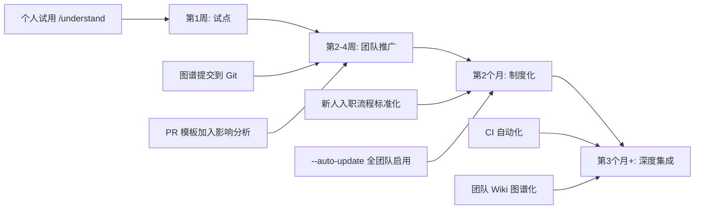

# Understand-Anything 插件最佳实践指南

> 适用版本：v2.7.3+ | 作者：社区整理 | 最后更新：2026-06-07

---

## 一、概述与核心价值

### 1.1 什么是 Understand-Anything

Understand-Anything 是一个开源的 **Claude Code 插件**（同时也支持 Codex、Cursor、Copilot、Gemini CLI 等 14+ 平台），由社区开发者 Lum1104 创建，目前获得 53.6k+ GitHub Stars。它的核心能力是：**将任意代码库、LLM Wiki 知识库或文档集，通过 Tree-sitter（确定性静态分析）+ LLM（语义理解）混合流水线，转化为结构化的 JSON 知识图谱，再通过交互式 Web 仪表盘实现可视化探索**。

简单说：你面对一个 20 万行的陌生代码库，不知道从哪里下手。运行 `/understand` 之后，你获得了一张可点击、可搜索、可缩放的知识图谱，每个文件、函数、类都是一个节点，附带自然语言摘要和依赖关系。你不再"盲读代码"，而是先看到全局结构，再定点深入。

### 1.2 解决的核心问题

| 问题 | Understand-Anything 的解决方式 |
|------|-------------------------------|
| **新成员入职难** | 自动生成架构导览（Guided Tour），按依赖顺序引导学习，配合 `/understand-onboard` 生成入职文档 |
| **代码审查风险高** | `/understand-diff` 在提交前展示变更的连锁影响范围，识别受影响模块和层级 |
| **业务逻辑难追踪** | `/understand-domain` 将代码映射到业务域、流程、步骤，生成水平领域图谱 |
| **知识孤岛** | 知识图谱以 JSON 提交到 Git，团队共享；一人分析，全员受益 |
| **大型 Monorepo 难以聚焦** | 支持子目录范围限定 `/understand src/frontend`，只分析你关心的子系统 |
| **非英语团队理解障碍** | 支持 `--language zh/ja/ko/ru` 等多语言输出，节点摘要和仪表盘 UI 均可本地化 |

### 1.3 核心设计哲学

Understand-Anything 的设计遵循三个原则：

1. **结构可复现，语义可理解**：Tree-sitter 负责确定性的代码结构提取（导入/导出、函数/类定义、调用点、继承关系），LLM 负责语义理解（自然语言摘要、标签、架构层分配、业务域映射）。结构侧每次运行结果一致，语义侧捕获开发者的真实意图。

2. **渐进式分析，而非一次性**：默认增量更新——仅重新分析自上次运行以来变更的文件。支持 `--auto-update` 通过 post-commit hook 保持图谱与代码同步。不是"分析一次就过时"的静态文档。

3. **图谱即代码（Graph-as-Code）**：知识图谱存储为纯 JSON 文件，可提交到 Git、可通过 PR 审查、可作为 CI 流水线的一部分。它不只是可视化工具，更是可版本管理的项目资产。

### 1.4 与 Claude Code 内置功能的区别

| 能力 | Claude Code 内置 | Understand-Anything |
|------|-----------------|---------------------|
| 代码搜索 | Grep / Glob 模式匹配 | 模糊搜索 + 语义搜索（"哪些部分处理认证？"） |
| 文件阅读 | 逐个文件读取到上下文 | 预构建知识图谱，按需检索子图 |
| 架构理解 | 依赖 LLM 临场推理 | 持久化的结构化知识图谱 + 可视化仪表盘 |
| 变更影响分析 | 无 | `/understand-diff` 自动分析连锁反应 |
| 团队协作 | 无共享机制 | JSON 图谱提交到 Git，团队成员直接使用 |
| 新人入职 | 需手动编写文档 | `/understand-onboard` 自动生成入职指南 |

**核心区别**：Claude Code 的代码理解是"即时的、临场的、依赖上下文窗口的"；Understand-Anything 是"预计算的、持久化的、结构化的"。两者互补而非替代——图谱让你快速定位，Claude Code 让你深入修改。

---

## 二、安装与环境配置

### 2.1 前置依赖

| 依赖项 | 最低版本 | 说明 |
|--------|---------|------|
| **Node.js** | 18+ (推荐 20 LTS) | 运行时环境，tree-sitter 原生模块需要编译 |
| **pnpm** | 10.6.2+ | 包管理器，通过 `package.json` 的 `packageManager` 字段锁定 |
| **Git** | 2.30+ | 版本控制，文件发现依赖 `git ls-files`，post-commit hook 功能需要 |
| **Claude Code** | 最新稳定版 | 插件运行的主环境，需已安装并登录 |
| **Git LFS** | 可选 | 当知识图谱超过 10MB 时建议启用，避免仓库膨胀 |

**注意**：如果你使用 Windows，tree-sitter 原生模块的编译需要 C++ 构建工具（Visual Studio Build Tools 或 windows-build-tools）。

### 2.2 安装方法

#### 方法一：插件市场安装（推荐，Claude Code 原生）

```bash
# 第一步：将插件添加到本地市场索引
/plugin marketplace add Lum1104/Understand-Anything

# 第二步：安装插件
/plugin install understand-anything
```

安装完成后，所有 `/understand*` 斜杠命令自动可用。

#### 方法二：一行命令安装（适用于 Codex / Cursor / VS Code Copilot / OpenCode / Gemini CLI 等）

**macOS / Linux：**
```bash
curl -fsSL https://raw.githubusercontent.com/Lum1104/Understand-Anything/main/install.sh | bash
```

**指定平台（跳过交互提示）：**
```bash
curl -fsSL https://raw.githubusercontent.com/Lum1104/Understand-Anything/main/install.sh | bash -s codex
```

**Windows（PowerShell）：**
```powershell
iwr -useb https://raw.githubusercontent.com/Lum1104/Understand-Anything/main/install.ps1 | iex
```

安装器会将仓库克隆到 `~/.understand-anything/repo` 并为指定平台创建符号链接。

**支持的平台标识**：`gemini`、`codex`、`opencode`、`pi`、`openclaw`、`antigravity`、`vibe`、`vscode`、`hermes`、`cline`、`kimi`、`trae`

**更新：**
```bash
./install.sh --update
```

**卸载：**
```bash
./install.sh --uninstall <platform>
```

#### 方法三：手动克隆（适用于 Cursor）

Cursor 通过 `.cursor-plugin/plugin.json` 自动发现插件，只需克隆仓库即可：

```bash
git clone https://github.com/Lum1104/Understand-Anything.git ~/.understand-anything/repo
```

### 2.3 环境配置

#### 配置文件一览

| 文件 | 位置 | 作用 |
|------|------|------|
| `plugin.json` | `.claude-plugin/plugin.json` | Claude Code 插件注册清单（斜杠命令、代理定义） |
| `config.json` | `.understand-anything/config.json` | 项目级持久化配置（语言偏好等） |
| `.understandignore` | `.understand-anything/.understandignore` | 分析排除规则（类似 `.gitignore`） |
| `knowledge-graph.json` | `.understand-anything/knowledge-graph.json` | 核心输出——完整知识图谱 |

#### 语言配置

首次运行 `/understand` 时不传 `--language` 参数，插件会自动检测当前对话语言：
- 如果对话语言非英语，会提示你确认后保存到 `config.json`
- 如果对话语言是英语，不做任何提示，默认使用英文输出

你也可以显式指定：

```bash
# 中文输出（节点摘要、仪表盘 UI、导览解释均使用中文）
/understand --language zh

# 其他支持的语言：zh-TW（繁体中文）、ja（日语）、ko（韩语）、ru（俄语）
/understand --language ja
```

语言配置持久化后，后续运行自动沿用，无需重复指定。

#### .understandignore 配置

插件首次分析时会自动生成一个 starter 文件：读取 `.gitignore` 并去重内置默认忽略项，添加检测到的目录（如 `__tests__`、`docs`、`scripts`），等待你审核确认。

内置默认忽略项（始终生效，除非用 `!` 前缀否定）：
```
node_modules/
.git/
dist/
*.lock
```

自定义示例：
```gitignore
# 忽略测试文件
**/*.test.ts
**/*.spec.ts
**/__tests__/

# 忽略自动生成的代码
**/generated/
**/*.pb.go

# 强制包含某些被全局规则排除的文件
!src/critical-vendored-lib/
```

#### Git LFS 配置（大图谱场景）

当知识图谱超过 10MB 时，建议使用 Git LFS：

```bash
# 安装 Git LFS
git lfs install

# 跟踪图谱 JSON 文件
git lfs track '.understand-anything/*.json'

# 提交 .gitattributes
git add .gitattributes
git commit -m "chore: enable Git LFS for knowledge graph files"
```

### 2.4 安装后验证

执行以下命令确认插件已正确安装：

```bash
# 1. 确认插件已注册（列出可用命令）
/help understand

# 2. 在一个测试项目中进行快速分析
cd /path/to/your/project
/understand --language zh

# 3. 检查图谱文件是否生成
ls -la .understand-anything/knowledge-graph.json

# 4. 启动仪表盘验证可视化
/understand-dashboard
```

如果仪表盘能正常打开并显示代码结构，说明安装成功。

---

## 三、基础使用指南

### 3.1 `/understand` —— 主分析命令

#### 命令语法

```bash
/understand [path?] [--language <en|zh|zh-TW|ja|ko|ru>] [--auto-update] [--review]
```

#### 参数说明

| 参数 | 类型 | 默认值 | 说明 |
|------|------|--------|------|
| `path` | 位置参数 | 项目根目录 | 限定分析子目录（Monorepo 场景） |
| `--language` | 选项 | `en` | 输出语言，首次运行自动检测对话语言 |
| `--auto-update` | 标志 | `false` | 启用 post-commit hook，每次提交后自动增量更新图谱 |
| `--review` | 标志 | `false` | 启用完整 LLM 图谱审查（graph-reviewer 代理），默认走内联快速审查 |

#### 内部流水线（7 阶段详解）

了解内部机制有助于排查问题和优化使用：

**Phase 0 — Pre-flight（前置检查）**
- 解析参数，决定全量分析还是增量更新
- Worktree 重定向：如果在 git worktree 中，自动将输出重定向到主仓库根目录（避免临时工作树销毁后图谱丢失）
- 确保核心包已构建（检查 `packages/core/dist/index.js`）
- 语言配置持久化

**Phase 0.5 — Ignore 配置**
- 自动生成 `.understandignore`（从 `.gitignore` 去重并添加检测到的目录）
- 用户审核确认

**Phase 1 — SCAN（项目扫描）**
- `project-scanner` 代理执行三步：LLM 生成项目元数据 → 确定性脚本遍历文件列表 → Tree-sitter 提取 import 映射
- 输出 `scan-result.json`（文件列表、语言、框架、import 映射）

**Phase 1.5 — BATCH（语义批处理）**
- 根据 import 关系使用贪心算法将文件分组成批（每批 20-30 个）
- 导入彼此的文件分到同一批，利用上下文关联提高分析质量
- 输出 `batches.json`

**Phase 2 — ANALYZE（文件分析）**——**最关键的阶段**
- 最多 5 个 `file-analyzer` 子代理并发，每个负责一批文件
- 每个 file-analyzer 两阶段：
  - **结构性提取**（脚本）：Tree-sitter 提取函数/类/导出/调用图
  - **语义分析**（LLM）：生成摘要、标签、复杂度、语言特性说明
- 输出 `batch-{N}.json`（或分批 `batch-{N}-part-{K}.json`）
- 合并脚本严格按正则 `batch-(\d+)(?:-part-(\d+))?\.json` 匹配，其他命名会被静默丢弃

**Phase 3 — ASSEMBLE REVIEW（组装评审）**
- `assemble-reviewer` 代理验证合并后图谱的完整性
- 交叉验证跨批边

**Phase 4 — ARCHITECTURE（架构分析）**
- `architecture-analyzer` 代理识别架构层次（API、Service、Data、UI 等）
- 注入语言上下文文件（如 `languages/python.md`）和框架增补（如 `frameworks/django.md`）
- 输出 `layers.json`

**Phase 5 — TOUR（导览构建）**
- `tour-builder` 代理按依赖顺序生成学习路径
- 每步包含 title/description/nodeIds/可选的 languageLesson
- 输出 `tour.json`

**Phase 6 — REVIEW（图谱验证）**
- 默认路径：内联确定性验证脚本检查节点完整性、边引用有效性
- `--review` 路径：完整 LLM 审查
- 自动修复缺失字段和悬空边

**Phase 7 — SAVE（保存）**
- 写入 `knowledge-graph.json`
- 构建结构性指纹基线（`fingerprints.json`）——**必须在 `meta.json` 之前完成**，否则后续 auto-update 会将所有文件视为 STRUCTURAL 变更导致全量重建
- 写入 `meta.json`（时间戳、commit hash、版本、文件列表）
- 清理中间文件
- 验证通过则自动启动仪表盘

#### 使用示例

```bash
# 示例 1：首次分析整个项目（中文输出）
/understand --language zh

# 示例 2：只分析前端子目录（Monorepo 场景）
/understand src/frontend --language zh

# 示例 3：启用自动更新 + 完整审查
/understand --auto-update --review

# 示例 4：强制全量重建（图谱已存在时默认走增量）
/understand --full

# 示例 5：大型项目，限定范围到特定模块
/understand packages/backend/services/payment --language zh
```

#### 常见陷阱

- **首次运行耗时较长**：大型项目首次全量分析可能需要较长时间和大量 token。建议非高峰时段运行，或先限定子目录范围。
- **增量更新数据丢失风险（已知 Bug #402）**：v2.7.x 中，增量模式下 `batch-existing.json` 因正则不匹配被静默丢弃，导致非变更节点全部丢失。建议在修复前使用 `--full` 进行关键节点的全量重建。
- **pnpm 11 兼容性问题（Issue #358）**：pnpm 11 下 lockfile 过期可能导致 tree-sitter grammar 版本不匹配，Python + TypeScript 项目的 import edges 提取为 0。建议使用 pnpm 10.6.2。
- **Agents 忽略 hooks 指令（Issue #384）**：Claude Code 平台的 agents 可能在运行时忽略 hooks 指令，导致需要不断手动确认。如果遇到此问题，可以用 `claude_code_interactive` 设置控制交互行为。

### 3.2 `/understand-chat` —— 基于知识图谱的对话问答

#### 命令语法

```bash
/understand-chat <question>
```

#### 功能说明

基于已构建的知识图谱，通过自然语言提问探索代码库。你可以询问架构、数据流、模块职责等任何问题。

**内部机制**：
1. 加载 `knowledge-graph.json`（通过 Grep 搜索而非全量读入上下文——避免大图谱撑爆上下文窗口）
2. 使用基于 Fuse.js 的 SearchEngine 进行模糊搜索：权重分布 name(0.4) / tags(0.3) / summary(0.2) / languageNotes(0.1)
3. 通过 1 跳邻居扩展结果（遍历所有边，若 source 或 target 在匹配集中则加入）
4. 收集相关 layers
5. 将结构化子图上下文 + 用户问题注入 LLM 进行回答

**关键设计**：不把整个图谱 JSON 放入上下文，而是通过搜索 + 1 跳扩展构建最相关的子图上下文。这使得即使面对数万节点的图谱也能高效问答。

#### 使用示例

```bash
# 询问支付流程
/understand-chat 支付流程是如何工作的？从用户下单到支付完成涉及哪些模块？

# 询问架构设计
/understand-chat 项目的整体架构是什么样的？有哪些主要层级？

# 询问特定功能
/understand-chat 哪些模块负责用户认证？认证流程如何与数据库交互？

# 询问依赖关系
/understand-chat auth.service.ts 依赖哪些模块？有哪些模块依赖它？

# 询问数据流
/understand-chat 数据从 API 层到数据库的完整流向是怎样的？

# 询问技术决策
/understand-chat 为什么项目选择使用 Redis 作为缓存层？哪些服务使用了它？
```

#### 最佳实践

- **先运行 `/understand` 构建图谱**：`/understand-chat` 依赖已存在的 `knowledge-graph.json`。
- **问题越具体，回答越精确**：与其问"讲讲这个项目"，不如问"用户登录的完整流程涉及哪些文件和函数"。
- **利用图谱的关联性**：`/understand-chat` 通过边扩展获取 1 跳邻居，所以关于模块间关联的问题回答质量特别高。
- **结合 `/understand-domain`**：先用 `/understand-domain` 构建业务领域图谱，再问业务问题，回答会更加贴合业务逻辑。

### 3.3 `/understand-dashboard` —— 交互式 Web 仪表盘

#### 命令语法

```bash
/understand-dashboard
```

#### 功能说明

启动一个交互式 Web 仪表盘，将代码库可视化为彩色编码、可搜索、可点击的知识图谱。

**内部机制**：
1. 检查 `knowledge-graph.json` 存在
2. 通过多路径解析找到 `packages/dashboard/`（CLAUDE_PLUGIN_ROOT → 通用 symlink → 技能路径自引用 → clone 安装路径）
3. 运行 `pnpm install` + `pnpm --filter @understand-anything/core build`
4. 启动 Vite dev server：`GRAPH_DIR=<project-dir> npx vite --host 127.0.0.1`
5. 生成安全令牌 URL（`?token=` 参数），防止未授权访问

**仪表盘技术栈**：React + TypeScript、React Flow（图谱可视化）、Zustand（状态管理）、TailwindCSS v4（暗黑主题）、Prism（代码查看器）

#### 仪表盘功能

| 功能 | 说明 |
|------|------|
| **平移 & 缩放** | 鼠标拖拽平移，滚轮缩放，无限制探索 |
| **节点点击** | 选中节点查看代码片段、自然语言摘要、关系列表 |
| **模糊搜索** | 搜索文件名、函数名，支持语义搜索 |
| **颜色编码** | 按架构层级自动着色（API=蓝、Service=绿、Data=黄、UI=紫、Utility=灰） |
| **导览模式** | 按 Guided Tour 顺序逐步高亮展示 |
| **领域视图** | 如果运行了 `/understand-domain`，可切换至业务域水平图 |
| **Persona-Adaptive UI** | 根据用户角色自动调整信息详细程度 |
| **Diff 覆盖层** | 如果运行了 `/understand-diff`，受影响节点会高亮标记 |

#### 最佳实践

- **仪表盘启动后保持运行**：Vite dev server 会持续运行，关闭终端前手动停止。
- **从仪表盘跳转到代码**：选中节点后可看到文件路径和关键代码片段，结合 Claude Code 的 `Read` 工具深入分析。
- **使用搜索快速定位**：仪表盘的模糊搜索比在终端中 grep 更直观，尤其适合"我不知道确切名称但知道功能"的场景。

### 3.4 `/understand-diff` —— Diff 影响分析

#### 命令语法

```bash
/understand-diff
```

#### 功能说明

分析当前未提交变更对整个系统的影响范围，展示哪些模块/组件会受影响（连锁反应分析）。**在提交前使用**，防止修改引发意外的破坏。

**内部机制**：
1. 获取变更文件列表（`git diff --name-only`）
2. 在图谱中匹配每个变更文件的 node
3. 扩展子节点（通过 `contains` 边找到变更的函数/类）
4. 通过 1 跳边扩展找到受影响节点（上游依赖方和下游被依赖方）
5. 识别受影响的 layers
6. 结构化输出：变更组件、受影响组件、受影响层级、风险评估
7. 写入 `diff-overlay.json`（不提交到 Git），仪表盘可叠加显示

#### 输出结构

```
Changed Components（直接变更）:
  - src/auth/login.ts (function: validateCredentials)
  - src/auth/login.ts (function: generateToken)

Affected Components（可能受影响）:
  Upstream (依赖变更文件的模块):
    - src/api/middleware.ts (imports validateCredentials)
    - src/api/routes/session.ts (imports generateToken)
  Downstream (变更文件依赖的模块):
    - src/db/user-repo.ts (被 validateCredentials 调用)

Affected Layers（受影响的架构层）:
  - API (middleware, routes)
  - Service (auth)
  - Data (user-repo)

Risk Assessment（风险评估）:
  - 爆炸半径: 中等 (3 个文件受影响)
  - 跨层影响: 是 (涉及 API、Service、Data 三层)
  - 高风险节点: generateToken (被 session 路由直接调用)
```

#### 使用示例

```bash
# 1. 修改了一些代码
vim src/auth/login.ts src/api/middleware.ts

# 2. 提交前评估影响
/understand-diff

# 3. 根据评估结果决定是否需要额外测试
# 4. 确认安全后提交
git commit -m "feat: add multi-factor authentication"
```

#### 最佳实践

- **PR 审查前必用**：在创建 PR 前运行 `/understand-diff`，将影响分析结果放入 PR 描述，帮助审查者理解变更范围。
- **结合测试**：影响分析结果直接告诉你需要重点测试哪些模块。
- **仪表盘叠加**：运行 `/understand-diff` 后再打开 `/understand-dashboard`，受影响节点会高亮显示。

### 3.5 `/understand-domain` —— 业务领域知识提取

#### 命令语法

```bash
/understand-domain
```

#### 功能说明

从代码库中提取业务领域知识，识别业务域（Domain）、流程（Flow）和步骤（Step），生成水平领域图谱。

输出结构为三级层次：
- **Domain**（业务域）：如"用户管理"、"订单处理"、"支付结算"
- **Flow**（业务流程）：如"用户注册流程"、"订单退款流程"
- **Step**（步骤）：流程中的具体步骤，关联到具体的代码节点

边类型：
- `contains_flow`：域包含流程
- `flow_step`：流程包含步骤（权重编码顺序）
- `cross_domain`：跨域关联

#### 内部机制

**场景一：已有知识图谱**
1. 直接读取 `knowledge-graph.json` 中的 nodes/edges/layers/tour
2. 将这些作为 `domain-analyzer` 代理的上下文，无需重新扫描

**场景二：无现有图谱**
1. 运行 `extract-domain-context.py` 生成 `domain-context.json`
2. 检测入口点（HTTP 路由、CLI 命令、事件处理器）
3. 调度 `domain-analyzer` 代理基于扫描上下文分析

输出保存为 `domain-graph.json`，仪表盘自动检测并切换到领域视图。

#### 使用示例

```bash
# 步骤 1：先构建代码图谱
/understand --language zh

# 步骤 2：提取业务领域
/understand-domain

# 步骤 3：在仪表盘中查看业务领域视图
/understand-dashboard

# 步骤 4：针对业务问题进行问答
/understand-chat 订单退款流程涉及哪些服务和数据表？
```

#### 最佳实践

- **先构建代码图谱**：`/understand-domain` 在有图谱时效果更好，能关联到具体代码节点。
- **适合产品经理和业务分析师**：领域视图将技术代码映射到业务流程，非技术人员也能理解系统。
- **大型代码库注意**：对于数万文件的项目，领域提取可能不够详细（已知社区反馈），建议先限定子目录范围。

### 3.6 `/understand-explain` —— 深度代码解释

#### 命令语法

```bash
/understand-explain <target>
```

#### 参数说明

`target` 支持两种格式：
- **文件路径**：`src/auth/login.ts`
- **文件路径 + 函数**：`src/auth/login.ts:validateCredentials`

#### 功能说明

对特定文件或函数进行深度分析，解释其作用、依赖关系和在系统架构中的位置。

**内部机制**：
1. 从图谱中匹配目标节点
2. 通过 `contains` 边找子节点（函数/类）
3. 通过 1 跳边找连接节点
4. 找到所属 layer
5. 构建结构化解释上下文：architectural role → internal structure → external connections → data flow
6. 要求 LLM 用"假设读者不熟悉该编程语言"的方式解释

#### 输出结构

```
## 架构角色
[该文件/函数在整体架构中的位置和职责]

## 内部结构
[包含的关键函数、类及其作用]

## 外部连接
[依赖的模块、被依赖的模块、数据来源和去向]

## 数据流
[数据如何进入、经过处理、输出到哪里]
```

#### 使用示例

```bash
# 解释一个文件的整体作用
/understand-explain src/services/payment.service.ts

# 深入解释一个特定函数
/understand-explain src/services/payment.service.ts:processRefund

# 解释一个关键类
/understand-explain src/models/Order.ts:Order

# 帮助新成员理解核心模块
/understand-explain src/app.ts
```

#### 最佳实践

- **用于 Code Review**：当 PR 涉及你不熟悉的模块时，先用 `/understand-explain` 理解该模块的职责和上下文。
- **新人学习利器**：按 Guided Tour 的顺序逐个 `/understand-explain` 关键文件，系统化学习代码库。
- **语言无关的解释**：即使你不熟悉该编程语言，`/understand-explain` 也会用通俗方式解释。

### 3.7 `/understand-knowledge` —— 知识库分析

#### 命令语法

```bash
/understand-knowledge <wikiPath>
```

#### 功能说明

专门针对 **Karpathy 模式的 LLM Wiki**（三层结构：原始资料 raw/ + wiki markdown + schema 文件），构建力导向知识图谱，含社区聚类。

**适用场景**：
- 个人或团队的 LLM Wiki 知识库
- 研究笔记库
- 技术文档集合
- 任何使用 `[[wikilink]]` 语法的 Markdown 知识库

#### 内部机制

**Phase 1 — DETECT（确定性别解析）**
- 运行 `parse-knowledge-base.py`
- 从 `index.md` 提取分类（categories）
- 从各 `.md` 文件提取 wikilinks（`[[target]]` 语法）、标题、frontmatter
- 识别 `raw/` 目录中的源文档
- 输出 `scan-manifest.json`

**Phase 3 — ANALYZE（LLM 语义分析）**
- 调度 `article-analyzer` 子代理
- 每批 10-15 篇文章，按分类分组，最多 3 批并发
- 提取：实体（entities）、声明/论断（claims）、隐含关系（cites、contradicts、builds_on、exemplifies）

**Phase 4 — MERGE（合并）**
- 运行 `merge-knowledge-graph.py`
- 合并扫描结果和 LLM 分析
- 去重实体（大小写不敏感）
- 构建 layers（从 index.md 分类）和 tour（从 index.md 章节顺序）

图谱使用 `kind: "knowledge"` 标记，仪表盘使用**力导向布局**（体现知识的网络化特点），而非代码图谱的层级 dagre 布局。

#### Karpathy Wiki 结构示例

```
~/wiki/
├── index.md              # 分类和导读
├── machine-learning/
│   ├── transformers.md   # 包含 [[attention]], [[embedding]] 等内部链接
│   └── deep-learning.md
├── systems/
│   ├── databases.md
│   └── distributed.md
└── raw/                  # 原始参考文档
    ├── paper1.pdf
    └── article2.md
```

#### 使用示例

```bash
# 分析个人 Wiki
/understand-knowledge ~/wiki

# 分析团队知识库
/understand-knowledge /path/to/team/knowledge-base

# 分析后打开仪表盘（使用力导向布局）
/understand-dashboard
```

#### 最佳实践

- **需要 Karpathy 模式**：知识库需要遵循特定的目录结构（index.md + 分类子目录 + raw/），否则确定性解析器可能无法正确提取结构。
- **仪表盘自动适配**：知识库图谱自动使用力导向布局，区别于代码图谱的层级布局。
- **发现隐含关系**：LLM 代理会发现 wikilinks 之外的隐含关系（如两篇文章讨论同一概念但未互链），这是纯静态分析做不到的。

### 3.8 `/understand-onboard` —— 新成员入职引导

#### 命令语法

```bash
/understand-onboard
```

#### 功能说明

为团队新成员自动生成上手指南，包含架构总览、关键文件索引、推荐学习路径。

**内部机制**（TypeScript 源码 `src/onboard-builder.ts`）：
1. 从知识图谱中提取：
   - **Project Overview**：名称、语言、框架、描述
   - **Architecture Layers**：每层名称、描述、关键文件
   - **Key Concepts**：`concept` 类型节点
   - **Guided Tour**：按顺序的导览步骤
   - **File Map**：所有 file-level 节点的表格
   - **Complexity Hotspots**：标记为 "complex" 的节点
2. 生成结构化的 Markdown 文档
3. 提供将文档保存到 `docs/ONBOARDING.md` 并提交到仓库的选项

#### 输出结构示例

```markdown
# 项目入职指南：MyApp

## 项目概述
- **语言**：TypeScript 70%，Python 30%
- **框架**：Next.js 14, FastAPI, Prisma ORM
- **描述**：电商平台后端服务，处理订单、支付、库存管理

## 架构层级
| 层级 | 描述 | 关键文件 |
|------|------|----------|
| API | REST 接口层 | src/app/api/ |
| Service | 业务逻辑层 | src/services/ |
| Data | 数据访问层 | src/db/, src/models/ |
| UI | 前端组件 | src/components/ |

## 推荐学习路径
1. 先读 `src/app/layout.tsx` — 应用入口
2. 了解 `src/services/auth.service.ts` — 认证机制
3. 熟悉 `src/db/schema.ts` — 数据模型
4. ...

## 复杂度热点（需重点关注）
- `src/services/payment.service.ts:processPayment` (complex)
- `src/services/inventory.service.ts:reconcileStock` (complex)
```

#### 使用示例

```bash
# 第一步：构建图谱
/understand --language zh

# 第二步：提取业务领域（可选但推荐）
/understand-domain

# 第三步：生成入职指南
/understand-onboard

# 第四步：保存到仓库
# 按提示选择保存到 docs/ONBOARDING.md 并提交
```

#### 最佳实践

- **每次重大版本更新后重新生成**：入职指南可能随代码库演进而过时，建议在里程碑节点重新运行 `/understand-onboard`。
- **结合 Guided Tour**：入职指南中嵌入导览步骤，新成员可以按顺序学习。
- **提交到仓库**：将 `ONBOARDING.md` 提交到 Git，新成员 clone 后立即可读，无需等待图谱构建。
- **为非技术角色定制**：如果团队中有 PM 或 QA，可以让他们使用 `/understand-domain` + `/understand-dashboard` 领域视图来理解系统。

---

## 四、进阶使用技巧

### 4.1 组合命令构建工作流

#### 工作流一：新项目全面分析

```bash
# 阶段 1：构建代码图谱（中文输出 + 自动更新）
/understand --language zh --auto-update

# 阶段 2：提取业务领域
/understand-domain

# 阶段 3：生成入职指南
/understand-onboard

# 阶段 4：启动仪表盘进行可视化探索
/understand-dashboard

# 阶段 5：针对核心模块进行深度解释
/understand-explain src/core/business-logic.ts
```

#### 工作流二：PR 审查前的安全检查

```bash
# 1. 确保图谱是最新的
/understand

# 2. 分析变更影响
/understand-diff

# 3. 查看受影响的关键模块
/understand-explain src/services/affected-service.ts

# 4. 如果影响评估显示高风险，与团队讨论
/understand-chat 这个变更对支付模块有什么影响？有哪些测试需要更新？

# 5. 确认安全后提交
git commit -m "feat: add new feature"
```

#### 工作流三：大型 Monorepo 分包分析

```bash
# 分包子系统分别分析
/understand packages/backend --language zh
/understand packages/frontend --language zh
/understand packages/shared --language zh

# 各子系统独立问答
# 注意：跨包子系统的关联需要确保 import 路径正确解析
```

### 4.2 与 Claude Code 其他功能集成

#### 与 Hooks 集成

`--auto-update` 本质上是一个 post-commit hook。你可以在此基础上扩展：

```json
// .claude/settings.json 中添加
{
  "hooks": {
    "PostToolUse": [
      {
        "matcher": "Bash",
        "hooks": [
          {
            "type": "command",
            "command": "/understand --auto-update"
          }
        ]
      }
    ]
  }
}
```

#### 与 Skills 集成

如果你有自定义的技能（Skills），可以将 Understand-Anything 的命令嵌入其中：

```markdown
# my-custom-skill/SKILL.md

## 分析阶段
在开始实现之前，先用 /understand-explain 理解相关模块：

1. 运行 `/understand-explain src/module/related.ts` 理解上下文
2. 运行 `/understand-chat 这个模块的测试覆盖如何？` 了解测试现状
3. 开始编码
```

#### 与 Plan Mode 集成

在 Plan Mode 中，先运行 `/understand` 获取全局视角，再制定实施计划：

```bash
# 激活 Plan Mode
/plan

# 理解现状
/understand --language zh

# 基于图谱信息制定计划
# "基于 knowledge-graph.json 中的架构层级，我们可以在 Service 层新增..."
```

### 4.3 性能优化策略

#### Token 消耗优化

| 策略 | 说明 |
|------|------|
| **限定子目录** | `/understand src/frontend` 比分析整个项目节省大量 token |
| **增量更新** | 默认行为，仅处理变更文件，远低于全量分析 |
| **合理设置 .understandignore** | 排除测试文件、生成代码、第三方库等不重要的文件 |
| **避免频繁 --review** | `--review` 会触发完整 LLM 图谱审查，token 消耗显著增加 |
| **提交图谱到 Git** | 团队成员直接使用已构建的图谱，避免重复分析 |

#### 时间优化

| 策略 | 说明 |
|------|------|
| **非高峰时段运行首次分析** | 首次全量分析耗时最长，建议在夜间或非工作时间运行 |
| **利用并发** | 文件分析器最多 5 个并发，每批 20-30 个文件，这是内置最优配置 |
| **缓存中间结果** | `scan-result.json` 在增量运行时被保留，跳过重复扫描 |
| **--auto-update** | 每次提交后自动增量修补，避免积累大量变更后一次性处理 |

#### 大型代码库策略（数万文件）

```bash
# 1. 先分析核心模块
/understand src/core --language zh

# 2. 再分析其他子系统
/understand src/api --language zh
/understand src/services --language zh

# 3. 如果图谱太大（>10MB），启用 Git LFS
git lfs track '.understand-anything/*.json'

# 4. 考虑只提交关键图谱文件
# .understand-anything/ 中只提交 knowledge-graph.json 和 config.json
# 将 intermediate/ 和 diff-overlay.json 加入 .gitignore
```

### 4.4 知识库管理策略

#### 个人 Wiki 的建立与维护

```
# 推荐的 Wiki 目录结构
~/wiki/
├── index.md                    # 分类：AI, 系统设计, 编程语言, 工具
├── ai/
│   ├── llm-architecture.md     # 使用 [[tokenization]], [[attention]] 互链
│   ├── prompt-engineering.md
│   └── rag-systems.md
├── systems/
│   ├── distributed-systems.md
│   └── database-design.md
├── languages/
│   ├── rust-ownership.md
│   └── typescript-generics.md
├── tools/
│   ├── claude-code-plugins.md
│   └── understand-anything.md
└── raw/                        # 参考论文、文章 PDF
    ├── attention-is-all-you-need.pdf
    └── map-reduce-paper.pdf
```

```bash
# 定期分析知识库
/understand-knowledge ~/wiki --language zh

# 启动仪表盘探索知识关联
/understand-dashboard

# 发现知识盲区
/understand-chat 我的知识库中哪些领域覆盖不足？有哪些孤立的笔记？
```

#### 团队知识库的协作

```bash
# 一位成员运行分析
/understand-knowledge /path/to/team-wiki --language zh

# 提交图谱到 Git
git add .understand-anything/
git commit -m "chore: update team knowledge graph"
git push

# 其他成员拉取后直接使用
git pull
/understand-chat 我们的微服务架构有哪些关键决策记录？
```

### 4.5 多平台使用

如果你在多个 AI 编码工具之间切换，Understand-Anything 支持统一体验：

```bash
# Claude Code（原生插件）
/plugin install understand-anything

# Codex
curl -fsSL https://raw.githubusercontent.com/Lum1104/Understand-Anything/main/install.sh | bash -s codex

# VS Code Copilot
curl -fsSL https://raw.githubusercontent.com/Lum1104/Understand-Anything/main/install.sh | bash -s vscode

# Gemini CLI
curl -fsSL https://raw.githubusercontent.com/Lum1104/Understand-Anything/main/install.sh | bash -s gemini
```

不同平台间共享同一个 `.understand-anything/` 目录下的知识图谱。

---

## 五、团队协作场景

### 5.1 图谱共享：一人分析，全队受益

这是 Understand-Anything 最强大的团队特性之一。

#### 工作流

```bash
# 第一步：团队 Lead 或核心开发者运行分析
/understand --language zh --auto-update

# 第二步：检查产物
ls .understand-anything/
# knowledge-graph.json  (核心图谱)
# config.json            (语言配置)
# meta.json              (分析元数据)
# fingerprints.json      (结构指纹)
# intermediate/          (中间产物，不提交)

# 第三步：提交到 Git（排除中间产物）
# .gitignore 中添加
echo ".understand-anything/intermediate/" >> .gitignore
echo ".understand-anything/diff-overlay.json" >> .gitignore
echo ".understand-anything/.trash-*/" >> .gitignore

git add .understand-anything/ .gitignore
git commit -m "chore: add shared knowledge graph for team onboarding"
git push

# 第四步：团队成员拉取后立即可用
# 无需各自运行耗时的分析流水线
git pull
/understand-chat 项目的认证机制是怎么实现的？
/understand-dashboard
```

#### 大型图谱的 Git LFS 管理

```bash
# 当图谱超过 10MB 时
git lfs install
git lfs track '.understand-anything/*.json'
git add .gitattributes
git commit -m "chore: enable Git LFS for knowledge graph"
```

### 5.2 团队入职工作流

```
新成员入职第一周计划：

第 1 天：
  1. Clone 仓库（图谱已在其中）
  2. 阅读 /understand-onboard 生成的 ONBOARDING.md
  3. 打开 /understand-dashboard，浏览架构层级
  4. 按 Guided Tour 顺序了解项目结构

第 2-3 天：
  1. 使用 /understand-explain 深入学习分配模块
  2. 使用 /understand-chat 提出疑问
  3. 使用 /understand-diff 理解最近的 PR 变更影响

第 4-5 天：
  1. 开始小任务，提交前用 /understand-diff 评估影响
  2. 图谱自动增量更新（--auto-update），始终保持最新
```

### 5.3 代码审查集成

#### PR 审查中的图谱应用

```markdown
# PR 描述模板

## 变更概述
[简要描述]

## 影响分析（由 /understand-diff 生成）
- **直接变更**：3 个文件
- **受影响模块**：auth.service.ts, session.middleware.ts, user.model.ts
- **受影响层级**：Service, API, Data
- **风险评估**：中等（跨层影响，建议重点测试认证流程）

## 图谱参考
- 受影响节点见：[仪表盘链接或截图]
- Guided Tour 受影响的步骤：Step 3 (认证流程), Step 5 (会话管理)
```

#### 审查者的工作流

```bash
# 1. 拉取 PR 分支
git fetch origin pull/123/head:pr-123
git checkout pr-123

# 2. 更新图谱（增量）
/understand

# 3. 分析变更影响
/understand-diff

# 4. 深度理解关键变更
/understand-explain src/auth/login.ts:newAuthFlow

# 5. 在仪表盘中可视化查看
/understand-dashboard

# 6. 留下审查意见（基于图谱上下文）
```

### 5.4 知识连续性（防止巴士因子）

> 巴士因子（Bus Factor）：项目中有多少人被巴士撞了之后项目会陷入瘫痪。

Understand-Anything 通过以下方式降低巴士因子：

1. **图谱作为活文档**：与代码同步更新，不会像手写文档那样过时
2. **业务领域可追溯**：`/understand-domain` 将业务逻辑映射到代码，即使原作者离开也能理解"为什么这段代码存在"
3. **入职指南自动化**：不需要资深成员花时间手写文档
4. **代码审查知识沉淀**：每次 PR 的 diff 分析结果可作为历史参考

```bash
# 关键节点保护策略
# 每月运行一次全量分析（确保知识不丢失）
0 0 1 * * cd /path/to/project && claude --print "/understand --full --language zh"

# 启用自动更新（日常保持同步）
/understand --auto-update
```

### 5.5 CI/CD 集成可能性

虽然 Understand-Anything 主要设计为交互式使用，但可以通过脚本化实现 CI 集成：

```yaml
# .github/workflows/knowledge-graph.yml (概念性示例)
name: Update Knowledge Graph

on:
  push:
    branches: [main]

jobs:
  update-graph:
    runs-on: ubuntu-latest
    steps:
      - uses: actions/checkout@v4
        with:
          fetch-depth: 0

      - name: Setup Node.js
        uses: actions/setup-node@v4
        with:
          node-version: '20'

      - name: Install pnpm
        run: npm install -g pnpm@10.6.2

      # 注意：以下为概念性步骤，实际自动化需要
      # Claude Code CLI 的 headless 模式支持
      - name: Update Knowledge Graph
        run: |
          # 需要 Claude API key 和合适的 headless 模式
          # claude --print "/understand --auto-update"

      - name: Commit updated graph
        run: |
          git config user.name "graph-bot"
          git config user.email "bot@example.com"
          git add .understand-anything/
          git diff --staged --quiet || git commit -m "chore: auto-update knowledge graph"
          git push
```

**注意**：CI 自动化需要 Claude Code 的 headless/non-interactive 模式支持，这取决于 Claude Code 的版本和 API 能力。

### 5.6 团队采纳最佳实践

| 阶段 | 行动 | 预期效果 |
|------|------|----------|
| **试点期（1-2 周）** | 选 1-2 个核心模块由 Lead 运行分析 | 验证工具价值，熟悉命令 |
| **推广期（1 个月）** | 图谱提交到仓库，全员可访问；在 2-3 个 PR 中使用 `/understand-diff` | 团队成员体验图谱价值 |
| **制度化** | 新人入职流程加入图谱步骤；PR 模板加入影响分析章节；`--auto-update` 启用 | 图谱成为日常开发的一部分 |
| **优化期** | 调优 `.understandignore`；建立知识库 Wiki；持续改进工作流 | 最大化投入产出比 |

---

## 六、常见问题与故障排除

### 6.1 安装问题

#### Q: 安装后 `/understand` 命令不可用

```bash
# 检查插件是否已注册
/plugin list

# 如果未显示，重新安装
/plugin marketplace add Lum1104/Understand-Anything
/plugin install understand-anything

# 重启 Claude Code 会话
```

#### Q: tree-sitter 原生模块编译失败（Windows）

```powershell
# 安装 Windows 构建工具（以管理员身份运行）
npm install --global windows-build-tools

# 或者安装 Visual Studio Build Tools
# https://visualstudio.microsoft.com/downloads/#build-tools-for-visual-studio-2022
# 选择 "Desktop development with C++" 工作负载
```

#### Q: pnpm 版本不匹配

```bash
# 检查当前 pnpm 版本
pnpm --version

# 安装指定版本
npm install -g pnpm@10.6.2

# 或使用 corepack（Node.js 16.9+）
corepack enable
corepack prepare pnpm@10.6.2 --activate
```

### 6.2 配置问题

#### Q: import edges 提取为 0（尤其 Python + TypeScript 项目）

**原因（Issue #358）**：pnpm 11 下 lockfile 过期导致 tree-sitter grammar 版本不匹配。

**解决**：
```bash
# 降级 pnpm 到 10.6.2
npm install -g pnpm@10.6.2

# 清理并重新安装
rm -rf node_modules pnpm-lock.yaml
pnpm install

# 重新构建
pnpm --filter @understand-anything/core build
```

#### Q: 增量更新后节点丢失

**原因（Issue #402）**：这是一个已知 Bug，增量模式下 `batch-existing.json` 因正则不匹配被静默丢弃。

**临时解决**：
```bash
# 在进行重要分析时使用 --full 强制全量重建
/understand --full --language zh
```

**检查是否受影响**：
```bash
# 比较图谱节点数与项目文件数
cat .understand-anything/knowledge-graph.json | python -c "import json,sys; d=json.load(sys.stdin); print(f'节点数: {len(d.get(\"nodes\",[]))}')"

# 如果节点数明显少于文件数，可能遇到了此问题
```

#### Q: Agents 不断要求手动确认

**原因（Issue #384）**：Claude Code 平台的 agents 可能忽略 hooks 指令。

**解决**：
- 检查 `.claude/settings.json` 中的权限配置
- 考虑使用 `claude_code_interactive` 用户设置控制交互行为
- 尝试在项目级 settings 中添加相关工具的允许规则

### 6.3 性能问题

#### Q: 首次分析太慢，token 消耗太高

```bash
# 策略 1：限定范围
/understand src/core --language zh

# 策略 2：先排除不重要的文件
# 编辑 .understand-anything/.understandignore，添加：
**/*.test.ts
**/*.spec.ts
**/__tests__/
**/docs/

# 策略 3：分批分析不同子系统
/understand packages/backend --language zh
/understand packages/frontend --language zh

# 策略 4：使用更简单的语言（减少 LLM 分析复杂度）
# 英文输出通常比中文输出 token 消耗更少
/understand --language en
```

#### Q: 仪表盘启动慢或卡顿

```bash
# 原因：大图谱（数十 MB）在浏览器中渲染压力大
# 解决 1：限定分析范围（见上）
# 解决 2：启用 Git LFS（图谱文件本身不影响仪表盘性能）
# 解决 3：社区正在讨论 sharding 支持（关注 Issue #406 相关讨论）
```

### 6.4 图谱损坏恢复

#### Q: "Invalid knowledge graph: Missing or invalid project metadata"

**可能原因**（Issue #406）：
- Node.js 版本兼容性问题（尤其 macOS + Node v24.13.0）
- 中途中断导致 JSON 文件不完整

**恢复步骤**：
```bash
# 1. 备份当前图谱（如果有价值的部分内容）
cp .understand-anything/knowledge-graph.json .understand-anything/knowledge-graph.json.bak

# 2. 清理中间产物
rm -rf .understand-anything/intermediate/

# 3. 强制全量重建
/understand --full --language zh

# 4. 若仍有问题，完全重置
rm -rf .understand-anything/
/understand --full --language zh
```

#### Q: 图谱与当前代码不同步

```bash
# 检查图谱时间戳
cat .understand-anything/meta.json | python -c "import json,sys; d=json.load(sys.stdin); print(d.get('lastAnalyzedAt'))"

# 方法 1：增量更新（自动检测变更）
/understand

# 方法 2：强制全量重建
/understand --full

# 方法 3：启用自动更新（推荐）
/understand --auto-update
```

### 6.5 其他常见问题

#### Q: PHP 项目分析不完整

**已知限制（Issue #367）**：
- PHP 文件作用域（top-level）调用未被捕获
- include/require 关系未映射
- 过程式 PHP 覆盖率接近 0%

**建议**：
- 对于 OOP 风格的 PHP 项目（使用类），分析效果仍然可用
- 对于过程式 PHP，期待社区贡献（已有 PR #400 尝试修复）

#### Q: Git Worktree 中运行的问题

```bash
# 问题：在 worktree 中运行 /understand，分析结果可能丢失
# 原因：worktree 被删除后输出目录随之消失

# 解决：插件自动检测 worktree 并将输出重定向到主仓库
# 无需手动处理，但需要确保主仓库路径可写

# 验证
git rev-parse --git-dir
git rev-parse --git-common-dir
# 如果两者不同，你在 worktree 中，插件会自动处理
```

#### Q: 多语言项目输出语言混乱

```bash
# 确保项目级语言配置正确
cat .understand-anything/config.json
# 应包含: {"language": "zh"}

# 手动设置
echo '{"language": "zh"}' > .understand-anything/config.json

# 或通过命令行重新指定
/understand --language zh
```

---

## 七、总结与建议

### 7.1 何时使用 Understand-Anything

#### 强烈推荐

- 加入一个超过 100 个文件的新代码库
- 需要对陌生代码库进行架构级别的修改
- 团队有新成员频繁入职
- Monorepo 中需要理解跨包依赖
- 代码审查中希望评估连锁影响
- 需要将技术代码解释给非技术人员（PM、QA）
- 维护一个 Karpathy 模式的 LLM Wiki 知识库

#### 可以考虑

- 小型项目（<50 文件）：图谱构建的投入产出比可能不高，直接用 Claude Code 阅读代码即可
- 频繁重构的早期项目：图谱需要频繁更新，维护成本较高
- 单一语言、简单架构的项目：Claude Code 内置的代码理解可能已足够

#### 不推荐

- 临时的一次性代码阅读（用 `/understand-explain` 单文件分析可能更合适）
- 非 Git 管理的项目（文件发现和增量更新依赖 Git）
- 极其庞大的代码库（数万文件）且没有限定子目录——图谱可能过大，首次分析耗时极长

### 7.2 按团队规模推荐的工作流

#### 个人开发者

```bash
# 核心流程
/understand --language zh          # 一次性分析
/understand-chat <question>        # 随时提问
/understand-diff                   # 提交前检查
/understand-explain <file>         # 深入理解

# 建议
# - 不需要 --auto-update（手动运行即可）
# - 图谱不需要提交（本地使用）
```

#### 小团队（2-10 人）

```bash
# 核心流程
/understand --language zh --auto-update  # Lead 运行
# → 提交图谱到 Git
# → 团队成员直接使用

# 团队规范
# - PR 描述中包含 /understand-diff 输出
# - 新人入职第一周按 /understand-onboard 产出的指南学习
# - 每月一次 /understand --full 全量重建

# 建议
# - 启用 Git LFS（如果图谱 >10MB）
# - .understandignore 纳入代码审查范围
```

#### 中型团队（10-50 人）

```bash
# 核心流程
# → 指定代码守护者（Code Steward）管理图谱
# → CI 中集成图谱更新（如果平台支持）
# → 不同子系统分别维护图谱

# 团队规范
# - PR 模板中强制包含影响分析章节
# - 入职流程标准化（图谱 + 领域视图 + 导览）
# - 架构变更必须更新领域图谱
# - 季度性全量重建

# 建议
# - 考虑建立团队 Wiki（Karpathy 模式），用 /understand-knowledge 管理
# - 在团队文档站嵌入仪表盘截图
```

#### 大型团队（50+ 人）

```bash
# 核心流程
# → 按团队/子系统拆分图谱
# → 每团队维护各自的 .understand-anything/
# → 架构委员会维护跨团队的总览图谱

# 团队规范
# - 图谱质量纳入代码审查 Checklist
# - 新人入职培训中包含 Understand-Anything 使用教程
# - 定期评估图谱覆盖率（多少核心模块已被图谱化）
# - 建立图谱变更的变更日志

# 建议
# - 自定义仪表盘集成到内部开发者门户
# - 探索 MCP Server 集成（如果有自定义工具需要与图谱关联）
```

### 7.3 集成路线图建议



### 7.4 最后的话

Understand-Anything 的核心价值不在于"生成一张看起来很酷的图谱"，而在于：

1. **降低认知负荷**：从"我需要读 200 个文件来理解这个系统"变为"我先看看图谱中的关键节点"
2. **加速知识传递**：从"老员工花 3 天给新人讲架构"变为"新人自己探索图谱，老员工只回答图谱无法解答的深层问题"
3. **预防知识流失**：从"这个模块只有张三懂"变为"图谱记录了模块的职责和依赖，任何人都能接手"
4. **提升代码审查质量**：从"我看这个 PR 改了几个文件，感觉没问题"变为"我看到这个变更会影响认证、会话和数据层，需要重点测试"

记住插件作者的设计哲学：

> "目标不是生成一张让你惊叹'代码库多复杂'的图谱，而是生成一张安静地教会你'每个部分如何拼在一起'的图谱。"

---

## 附录

### A. 命令速查表

| 命令 | 用途 | 前置条件 |
|------|------|----------|
| `/understand [path] [--language <lang>] [--auto-update] [--review]` | 构建/更新知识图谱 | 无（首次需安装插件） |
| `/understand-chat <question>` | 基于图谱问答 | `knowledge-graph.json` 已生成 |
| `/understand-dashboard` | 启动交互式可视化 | `knowledge-graph.json` 已生成 |
| `/understand-diff` | 分析未提交变更的影响 | `knowledge-graph.json` 已生成 |
| `/understand-domain` | 提取业务领域知识 | 推荐先有 `knowledge-graph.json` |
| `/understand-explain <target>` | 深度解释文件/函数 | `knowledge-graph.json` 已生成 |
| `/understand-knowledge <wikiPath>` | 分析 LLM Wiki 知识库 | Karpathy 模式 Wiki |
| `/understand-onboard` | 生成新成员入职指南 | `knowledge-graph.json` 已生成 |

### B. 支持的语言

| 代码 | 语言 | 适用命令 |
|------|------|----------|
| `en` | English（默认） | 全部 |
| `zh` | 简体中文 | 全部 |
| `zh-TW` | 繁體中文 | 全部 |
| `ja` | 日本語 | 全部 |
| `ko` | 한국어 | 全部 |
| `ru` | Русский | 全部 |

### C. 支持的编程语言（Tree-sitter 静态分析）

C, C#, C++, Go, Java, JavaScript, PHP, Python, Ruby, Rust, TypeScript

（其他语言可通过社区 PR 添加，如 SystemVerilog #382 正在贡献中）

### D. 关键文件路径

| 文件 | 默认位置 |
|------|---------|
| 知识图谱 | `.understand-anything/knowledge-graph.json` |
| 项目配置 | `.understand-anything/config.json` |
| 分析元数据 | `.understand-anything/meta.json` |
| 结构指纹 | `.understand-anything/fingerprints.json` |
| 忽略规则 | `.understand-anything/.understandignore` |
| 中间产物 | `.understand-anything/intermediate/`（不提交） |
| Diff 覆盖层 | `.understand-anything/diff-overlay.json`（不提交） |
| 领域图谱 | `.understand-anything/domain-graph.json` |

### E. 相关资源

| 资源 | URL |
|------|-----|
| GitHub 仓库 | https://github.com/Lum1104/Understand-Anything |
| 官方网站（含 Live Demo） | https://understand-anything.com |
| GitHub Issues | https://github.com/Lum1104/Understand-Anything/issues |
| GitHub Discussions | https://github.com/Lum1104/Understand-Anything/discussions |
| Discord 社区 | README 中有邀请链接（当前可能过期，查看 #407） |
| 多语言 README | 仓库 `READMEs/` 目录 |
| 项目架构文档 | 仓库 `CLAUDE.md` |
| 贡献指南 | 仓库 `CONTRIBUTING.md` |
| MIT 许可证 | 仓库 `LICENSE` |
