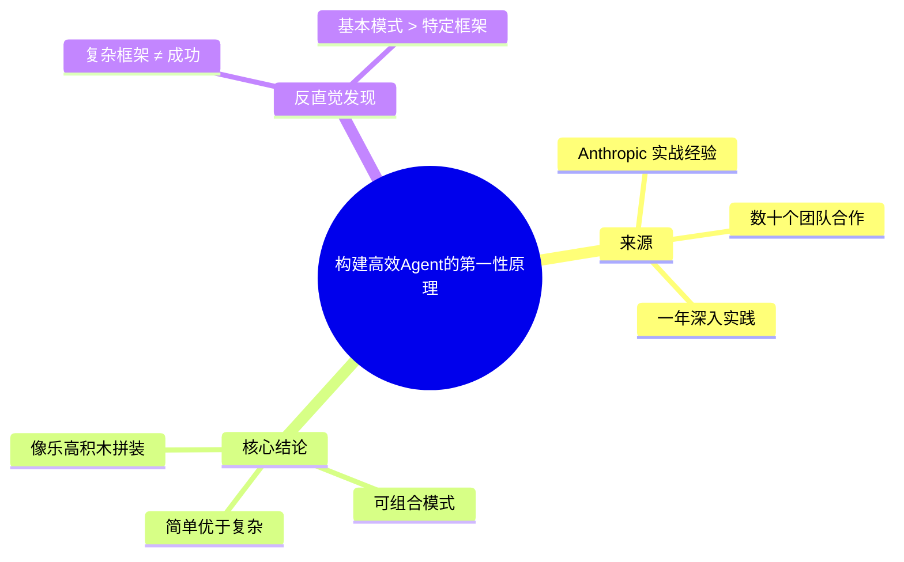
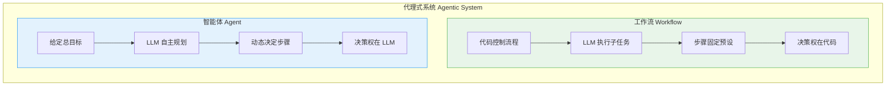
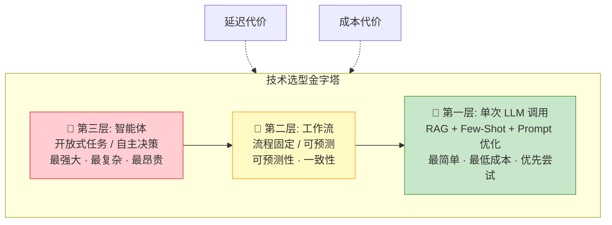
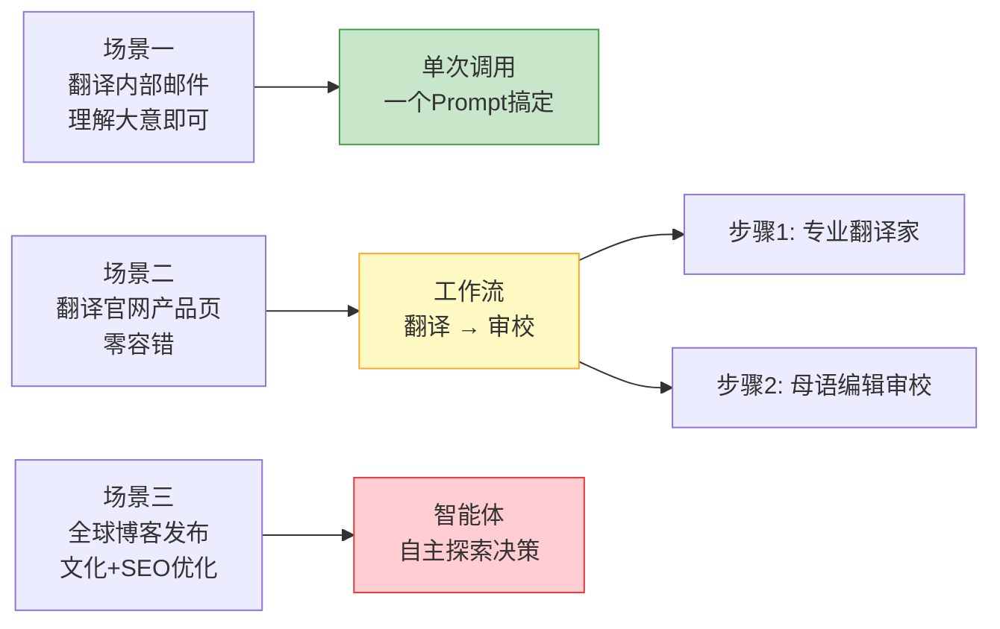
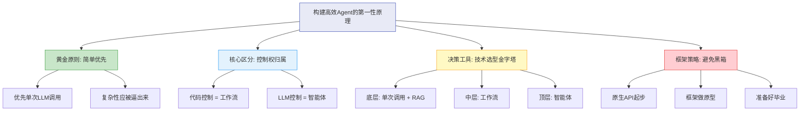

# 构建高效Agent的第一性原理 — 精读《Building Effective Agents》

## 音频元数据
- **标题**: Anthropic构建高效Agent的第一性原理 — 精读《Building Effective Agents》
- **来源**: Bilibili / 漫学AI系列
- **转录工具**: Whisper
- **总字数**: 约2200字
- **标签**: #音频转录 #LLM智能体 #Agent架构 #Anthropic #第一性原理

---

## 第1章: 引言与背景 — 为什么要谈Agent的第一性原理

### 内容概要
介绍本期主题来源于 Anthropic（Claude 大模型开发者）的实战经验总结。Anthropic 在过去一年里与各行业数十个团队深入合作构建 LLM 智能体，得出一个核心且反直觉的结论：最成功的 LLM 智能体不是用复杂框架构建的，而是采用简单、可组合的模式。

### 关键词汇
- **LLM（大型语言模型）**: 如 Claude、GPT 等能理解和生成自然语言的 AI 模型
- **智能体（Agent）**: 能够自主决策、调用工具完成任务的 AI 系统
- **第一性原理**: 从最基本的事实和原理出发思考问题，而非从惯例或经验出发
- **可组合模式**: 像乐高积木一样可以灵活拼装的基本构建模块

### 章节内容
当前 LLM 智能体领域讨论火热，各种框架和工具层出不穷。但 Anthropic 通过大量实战发现，最成功的智能体并非依赖复杂的全栈框架，而是采用简单、可组合的模式来构建。这意味着与其一头扎进复杂框架，不如先理解那些像乐高积木一样可以灵活拼装的基本模式。这是整个讨论的基调。

### 本章要点
- Anthropic 的结论来自与数十个团队的实际合作，不是纸上谈兵
- 最成功的智能体采用简单、可组合模式，而非复杂框架
- 理解基本模式比学习特定框架更重要

### 图表



---

## 第2章: 工作流 vs 智能体 — 核心概念辨析

### 内容概要
Anthropic 提出了"代理式系统"（Agentic System）的上位概念，并在其中清晰划分出两种架构：**工作流（Workflow）**和**智能体（Agent）**。两者的核心差异在于"决策权在哪里"以及"流程是否固定"。

### 关键词汇
- **代理式系统（Agentic System）**: 包含工作流和智能体的上位概念，统一了业界对 Agent 的混乱定义
- **工作流（Workflow）**: 流程固定、步骤预设，LLM 作为执行者被代码调用，决策权在代码
- **智能体（Agent）**: 流程动态、无固定剧本，LLM 自主决定下一步，决策权在 LLM

### 章节内容
业界对"智能体"的理解非常混乱：有人认为必须是能完全自主思考行动的"电子员工"，有人觉得只要能遵循预设流程就算智能体。Anthropic 提出了更清晰的分类框架：

**工作流**就像一条流水线或一份菜谱，任务的流程和步骤是固定的、预先设计好的。LLM 在其中更像一个"超级函数"，被代码调用去完成某个具体的子任务（如总结文本、提取关键信息）。决策权在代码，不在 LLM。

**智能体**更像一个真人，你给他一个总目标，但他没有固定剧本。他会根据情况动态地一步步决定：下一步该怎么做、该使用哪个工具、任务是否完成。决策权在 LLM，而不在代码。

**举例说明**：让 LLM "先总结一篇新闻，再调用发布 API"，流程固定，这是工作流；而让 LLM "帮我推广这款新产品"，他需要自主决定是写推文、发博客还是先做市场调研，这就是智能体。

### 本章要点
- 区分工作流和智能体的关键：决策权在代码还是在 LLM
- 工作流 = 流程固定 + LLM 作为执行者
- 智能体 = 流程动态 + LLM 作为决策者
- 理解这个核心区别对后续技术选型至关重要

### 图表



---

## 第3章: 技术选型金字塔 — 何时用什么方案

### 内容概要
Anthropic 的黄金原则是"始终从最简单的方案开始"。作者设计了一个三层技术选型金字塔，帮助开发者判断何时使用单次 LLM 调用、工作流、还是智能体。核心考量是延迟和成本的权衡。

### 关键词汇
- **RAG（检索增强生成）**: 通过检索外部知识来增强 LLM 回答质量的技术
- **Few-Shot（少样本示例）**: 在 Prompt 中提供少量示例帮助 LLM 理解任务
- **延迟（Latency）**: 多次 LLM 调用导致响应时间变长
- **成本（Cost）**: 每次 LLM 调用和工具使用都消耗 Token，累积费用更高

### 章节内容
Anthropic 给出了一个核心建议：始终从最简单的方案开始，只有当简单方案确实无法满足需求时才增加复杂性。代理式系统有两大代价：**延迟**（多次 LLM 调用导致响应变慢）和**成本**（每次调用消耗 Token，费用累积）。

**技术选型金字塔三层结构**：

- **第一层（底部）— 基础方案**：优化单一 LLM 调用。这是最简单、最低成本的方案，应该优先尝试。通过引入 RAG（检索增强生成）和 Few-Shot（少样本示例）就可以解决大部分问题，很多时候一个精心设计的 Prompt 就够了。

- **第二层（中间）— 中级方案**：工作流。当单次 LLM 调用确实不够用，且任务流程固定、明确、可预测时，选择构建工作流。它能带来可预测性和一致性的结果。

- **第三层（顶端）— 高级方案**：智能体。只有当任务是开放式的、无法预测步骤、需要模型大规模自主决策时，才选择构建真正的智能体。这是最强大但也最复杂、最昂贵的方案。

### 本章要点
- 黄金原则：始终从最简单的方案开始
- 代理式系统的两大代价：延迟和成本
- 金字塔从下到上：单次调用 → 工作流 → 智能体，复杂度和成本递增
- 大部分场景下，优化单次 LLM 调用就能解决问题

### 图表



---

## 第4章: 实战案例 — 翻译场景的技术选型

### 内容概要
通过翻译这一常见任务，详细演示如何运用金字塔模型进行技术选型。不同的质量要求和使用场景，决定了应该选择单次调用、工作流还是智能体。

### 关键词汇
- **单次调用**: 一个 Prompt 完成翻译，速度快、成本低
- **两步提示链**: 先翻译后审校的工作流模式，通过角色分离提升质量
- **角色分离**: 让 LLM 在不同步骤中扮演不同角色（翻译家 vs 编辑），使每步更专注

### 章节内容
以翻译任务为例，展示三种方案的适用场景：

**场景一：翻译内部邮件**（理解大意即可）→ **单次调用**。直接在一个 Prompt 里说"把这个翻译成中文并检查语法"，速度快、成本低，即使翻译有小瑕疵也不影响使用。适用于对质量要求不高、追求效率的场景。

**场景二：翻译公司官网产品页**（任何错误都可能损失客户）→ **工作流**。设计两步提示链：第一步让 LLM 扮演"专业翻译家"全力翻译，第二步让 LLM 扮演"经验丰富的母语编辑"对译文进行严格审校。这种角色分离让每一步更专注，最终出品质量更高。适用于对质量有高标准、愿意为此付出成本的场景。

**场景三：翻译并发布到全球博客，根据当地文化和 SEO 要求优化**→ **智能体**。任务复杂到需要自主探索和决策：上网查资料、判断文化差异、优化 SEO。这才需要真正的智能体。

### 本章要点
- 技术选型取决于质量要求和场景复杂度，而非技术炫耀
- 单次调用：效率优先，容忍小瑕疵
- 工作流：质量优先，角色分离提升专注度
- 智能体：仅用于需要自主探索和决策的复杂场景

### 图表



---

## 第5章: 框架的正确使用方式 — 避免黑箱陷阱

### 内容概要
讨论 LangChain、Dify 等市面框架的优缺点，以及 Anthropic 对框架使用的明确建议。核心观点是框架适合原型验证，但在追求性能和可靠性时应回归底层原理。

### 关键词汇
- **黑箱问题**: 框架封装过多底层细节，出问题时难以调试
- **过度设计**: 框架的丰富功能容易诱导开发者把简单问题复杂化
- **原生 API**: 直接调用 LLM 提供商的 API，完全掌控底层行为
- **可视化编排工具**: 如 Dify、n8n 等通过图形界面构建 Agent 的工具

### 章节内容
市面上的框架（如 LangChain、Dify）优点是能快速上手验证想法，但代价是**黑箱**——框架封装了太多底层细节，一旦 Agent 出问题，调试极其痛苦，根本分不清是自己的逻辑错了还是框架的 Prompt 错了。而且框架的丰富功能容易诱导过度设计。

**Anthropic 的三步避坑指南**：

1. **从原生 API 开始**：别怕麻烦，自己动手写一次，才能真正理解 Agent 是怎么回事，建立第一性原理的认知。

2. **把框架当作原型工具**：用它快速验证想法，但一定要有意识地去理解底层是怎么工作的，别满足于做一个"调包侠"。

3. **准备好随时"毕业"**：当项目追求极致的性能和可靠性时，要勇敢地用学到的底层原理去重构核心代码。

对于 Dify、n8n 这类可视化编排工具也是一样：它们是绝佳的原型和简单自动化工具，但需要专业级性能和控制时，需要回归代码层面。

### 本章要点
- 框架优点：快速原型验证；缺点：黑箱、过度设计风险
- 从原生 API 开始建立底层认知
- 框架是原型工具，不是最终方案
- 追求性能和可靠性时要"毕业"到底层代码

### 图表

```mermaid
journey
    title 框架使用成长路径
    section 第一阶段: 入门
      从原生API开始动手: 5: 开发者
      理解Agent底层原理: 5: 开发者
      建立第一性原理认知: 5: 开发者
    section 第二阶段: 加速
      使用框架快速原型验证: 4: 开发者
      有意识理解框架底层: 4: 开发者
      避免做调包侠: 3: 开发者
    section 第三阶段: 毕业
      追求性能和可靠性: 5: 开发者
      用底层原理重构核心代码: 5: 开发者
      掌控全链路: 5: 开发者
```

---

## 第6章: 总结与回顾

### 内容概要
回顾全文核心观点，强调简单优先、理解底层原理的重要性。

### 关键词汇
- **简单优先**: 始终从最简单的方案开始的黄金原则
- **控制权区分**: 用决策权归属来区分工作流和智能体

### 章节内容
全文核心观点回顾：

1. 从**简单优先**这个黄金原则出发
2. 学会用**控制权**来区分工作流和智能体
3. 掌握**技术选型金字塔**帮助做决策
4. 正确使用框架，避免掉进**黑箱陷阱**

理解这些底层逻辑和选择原则，能帮助我们避免踩坑，真正构建出高效实用的 AI 应用。

### 本章要点
- 简单优先是贯穿始终的黄金原则
- 用控制权（决策权）区分工作流和智能体
- 技术选型金字塔：单次调用 → 工作流 → 智能体
- 框架是工具不是依赖，要建立第一性原理认知

### 图表



---

## 专业术语表

| 术语 | 定义 |
|------|------|
| **LLM（大型语言模型）** | 能理解和生成自然语言的 AI 模型，如 Claude、GPT |
| **智能体（Agent）** | 能自主决策、动态规划步骤、调用工具完成目标的 AI 系统 |
| **工作流（Workflow）** | 流程固定、步骤预设的自动化系统，LLM 作为执行者 |
| **代理式系统（Agentic System）** | 包含工作流和智能体的上位概念 |
| **RAG（检索增强生成）** | 通过检索外部知识增强 LLM 回答质量的技术 |
| **Few-Shot（少样本示例）** | 在 Prompt 中提供示例帮助 LLM 理解任务的技术 |
| **Prompt Engineering** | 通过精心设计提示词来优化 LLM 输出的技术 |
| **第一性原理** | 从最基本的事实出发思考问题，不依赖惯例或类比 |
| **黑箱** | 内部机制不可见，出问题时难以排查的系统特征 |

---

## 个人思考

1. **"简单优先"是被严重低估的原则**：在实际开发中，开发者（包括我自己）往往倾向于使用更"高级"的方案，但 Anthropic 用大量实战证明，大部分场景下优化单次 LLM 调用就足够了。复杂性应该是被"逼"出来的，而不是主动追求的。

2. **框架的双刃剑效应值得警惕**：框架降低了入门门槛，但也降低了理解深度。"调包侠"在原型阶段没问题，但在生产环境中，不理解底层原理的代价会在调试和优化时加倍偿还。

3. **工作流 vs 智能体的区分框架非常实用**：用"决策权在谁手里"这一个维度就能清晰判断，避免了概念混淆。这个框架可以直接用于团队内部的技术方案评审。

---

## 行动项

- [ ] 梳理当前项目中使用的 Agent 方案，用金字塔模型评估是否存在过度设计
- [ ] 选择一个现有的框架实现，尝试用原生 API 重写，对比性能和可维护性
- [ ] 在团队分享"工作流 vs 智能体"的概念区分框架，统一技术选型语言
- [ ] 对现有 LLM 调用进行审计，识别可以通过优化 Prompt/RAG/Few-Shot 解决的场景
- [ ] 建立技术选型决策文档，将金字塔模型纳入团队的 Agent 开发规范
