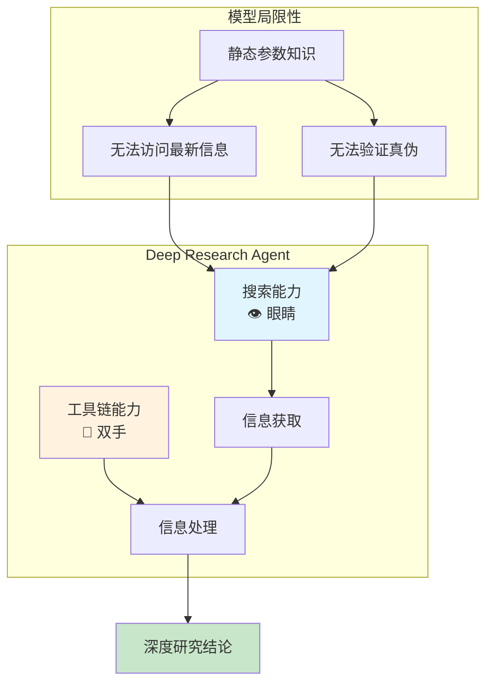
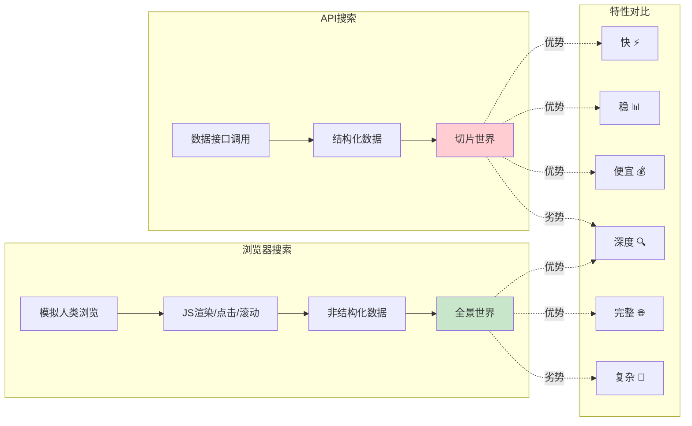
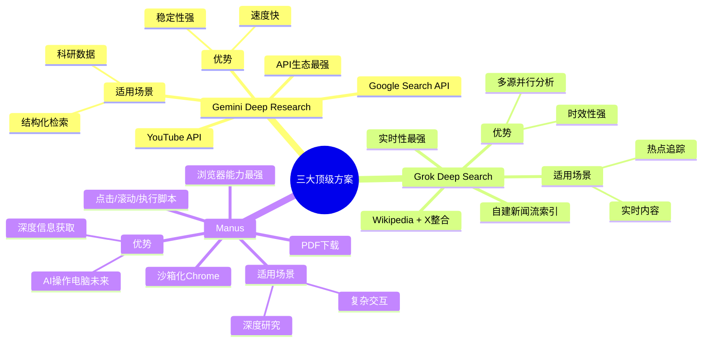
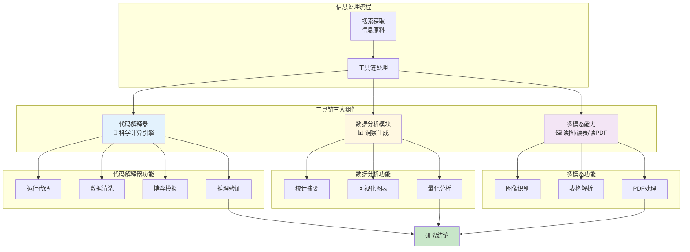
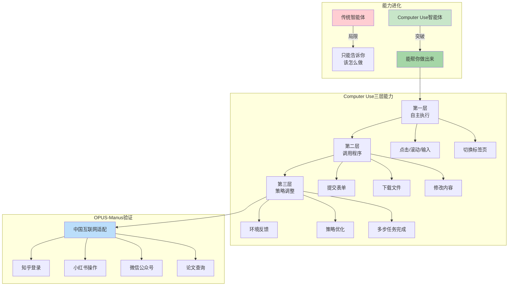
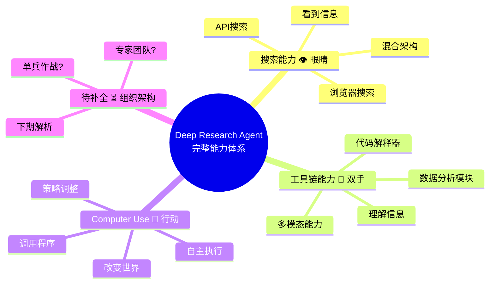

# Deep Research Agent 基础组件深度解析

## 音频元数据
- **标题**: Deep Research Agent 基础组件解析 - 搜索与工具链
- **来源**: Bilibili 视频 BV18vmxB3EBd
- **转录工具**: Whisper
- **总字数**: 约 2000 字
- **标签**: #AI智能体 #DeepResearch #搜索技术 #工具链

---

## 第1章: Deep Research Agent 的两大基础组件

### 内容概要
本章介绍 Deep Research Agent 的整体架构框架，阐明其必须建立的两大核心基础组件：搜索能力和工具链能力。搜索是智能体的"眼睛"，负责获取世界信息；工具链是智能体的"双手"，负责处理信息。

### 关键词汇
- **Deep Research Agent**: 深度研究智能体，具备自主搜索、分析和推理能力的AI系统
- **基础组件**: 构成智能体核心能力的底层系统模块
- **搜索能力**: 获取外部世界信息的能力，是智能体的信息入口

### 章节内容
在第一期视频中，我们拆解了 Deep Research Agent 整体的定义与架构。本期聚焦于它的两个最基础组件——为了完成真正的深度研究，智能体必须建立两套核心的基础组件。

第一套是**搜索能力**，它是智能体的眼睛，负责获取世界。
第二套是**工具链能力**，它是智能体的双手，负责处理信息。

本期的内容就是围绕这两个核心展开。首先，为什么 Deep Research Agent 必须依赖搜索？因为模型的参数知识是静态的，它无法访问最新信息，也无法验证真伪。所以搜索能力是 Deep Research Agent 的生命线——没有搜索就没有真正的深度研究。

### 图表

### 本章要点
- Deep Research Agent 需要两套核心组件：搜索能力与工具链能力
- 搜索能力解决信息获取问题，工具链解决信息处理问题
- 模型静态知识的局限性决定了搜索能力的必要性

---

## 第2章: API搜索 vs 浏览器搜索

### 内容概要
本章深入对比两种搜索策略的技术差异：API搜索和浏览器搜索。API搜索快速高效但信息受限；浏览器搜索复杂但能获取真正的深度信息，代表真实的完整世界。

### 关键词汇
- **API搜索**: 通过调用数据接口进行结构化检索，延迟低、效率高
- **浏览器搜索**: 模拟人类浏览网页，可处理JavaScript渲染、点击、滚动等复杂交互
- **结构化数据**: 经过预处理、格式化的数据，便于程序直接读取
- **非结构化数据**: 原始内容如网页、图表、PDF等，需额外处理

### 章节内容
在工程实践中，搜索路径逐渐形成了两个方向：**API搜索**和**浏览器搜索**。

可以用一句话概括它们的区别：
- **API检索**面向结构化检索目录，高效但范围有限
- **浏览器检索**面向亲访原始现场，更复杂却能获取真正的深度信息

API提供切片后的世界，浏览器提供全景的世界。

**API搜索的特点**是快、稳、便宜。智能体直接调用数据接口，延迟极低，数据结构化，非常适合大规模高效率的查询。但它的限制非常明显——你只能拿到API愿意给你的世界。如果信息藏在深层页面，或者没有开放接口，这条路就断了。

**浏览器搜索**则是真正的深度入境。它模拟人类打开一个网页，可以访问真实内容，处理JavaScript渲染、点击、滚动、跳转，并且抓取图表和PDF等非结构化数据。只有拥有浏览器能力，Agent才能像人一样进行多跳探索。

### 图表

### 本章要点
- API搜索优势：快速、稳定、成本低，适合结构化查询
- API搜索劣势：只能获取API开放的信息，无法深入
- 浏览器搜索优势：可访问完整网页内容，支持复杂交互
- 浏览器搜索代表真实世界，是深度研究的关键能力

---

## 第3章: 三大顶级方案对比分析

### 内容概要
本章分析三位顶级 Deep Research 方案的产品策略：Gemini Deep Research、Grok Deep Search 和 Manus。它们分别代表了API生态、实时性和浏览器能力的最强实现。

### 关键词汇
- **Gemini Deep Research**: Google旗下产品，API生态最强的代表
- **Grok Deep Search**: 实时性最强的代表，整合新闻流和社交媒体
- **Manus**: 浏览器能力最强的代表，运行完整沙箱化Chrome浏览器

### 章节内容
理解了原理，我们来看几位顶级玩家，他们是如何选择搜索策略的：

**第一位是 Gemini Deep Research**——它是API生态最强的代表。背靠Google，它整合了Google Search API和YouTube API，速度快、稳定性强，擅长科研中数据和结构化检索任务。

**第二位是 Grok Deep Search**——它是实时性最强的代表。它自建新闻流索引，并直接调用Wikipedia和X的原生结构，能够进行多源查询的并行分析，非常适合处理热点追踪和实效性内容。

**第三位是 Manus**——它是浏览器能力最强的代表。论文详细描述了它的实现方式：它运行着完整的沙箱化Chrome浏览器，能够点击、滚动、加载更多、执行脚本，甚至下载PDF。Manus代表了AI操作电脑的未来方向——它不只是简单的爬虫，而是能够操作电脑的自动化代理。

论文暗示了一个行业共识：虽然 Manus 和 Gemini Deep Research 系统没有公开细节，但为在稳定性与深度之间取得平衡，他们必然采用 API与浏览器混合架构。越接近真实网页的系统，研究深度越强。

### 图表

### 本章要点
- Gemini：API生态最强，适合科研和结构化任务
- Grok：实时性最强，适合热点追踪和时效内容
- Manus：浏览器能力最强，代表AI操作电脑的未来
- 混合架构是稳定性与深度的最佳平衡点

---

## 第4章: 工具链能力的三大核心组件

### 内容概要
本章阐述工具链能力的三大组成部分：代码解释器、数据分析模块和多模态能力。工具链是智能体处理信息的核心，将搜索获取的原料转化为研究结论。

### 关键词汇
- **代码解释器**: Deep Research的科学计算引擎，可运行代码、处理数据清洗、计算、模拟和推理验证
- **数据分析模块**: 将信息变成洞察，支持统计摘要、可视化图表和量化分析
- **多模态能力**: 智能体读图、读表、读PDF的能力，决定研究上限

### 章节内容
有了搜索回来的原料，我们还需要工具链这双手来进行加工。

论文指出：**搜索只是找到信息，工具链才负责加工信息**。如果缺少工具链，Deep Research只会变成一个高级搜索引擎。

核心的工具链有三部分组成：

**第一部分是代码解释器**——它是Deep Research的科学计算引擎。它不仅运行代码，还能处理数据清洗、数据计算、博弈模拟和推理验证。几乎所有领先的Deep Research系统都依赖代码解释器。没有代码执行，就没有科研级分析。

**第二部分是数据分析模块**——它把信息变成洞察。支持统计摘要、可视化图表生成和量化分析。普通搜索引擎给你内容，而Deep Research通过数据分析给你结论——这是两者最显著的区别。

**第三部分是多模态能力**——它要求智能体能读图、读表、读PDF。真实研究任务中，有一半的重要信息来自非文本格式。因此多模态直接决定了Deep Research的上限——没有多模态，就没有真正的研究助理。

### 图表

### 本章要点
- 代码解释器是科研级分析的核心基础
- 数据分析将信息转化为洞察和结论
- 多模态能力决定研究的深度上限
- 工具链使Agent超越搜索引擎，成为研究助理

---

## 第5章: Computer Use —— 行动能力的未来

### 内容概要
本章探讨计算机使用能力（Computer Use）的战略意义。这是Deep Research Agent从研究工具迈向自主行动智能体的关键一步，标志着智能体真正开始介入并改变世界。

### 关键词汇
- **Computer Use**: 智能体操作计算机的能力，包含自主执行、调用程序、策略调整
- **自主执行**: 在真实网页中自动执行点击、滚动、输入等操作
- **行动闭环**: 从规划到执行的完整能力链路
- **OPUS-Manus**: 论文特别点名的能力验证案例，能适配复杂中国互联网环境

### 章节内容
论文第三章末尾讨论了一个具有战略意义的能力——**计算机使用能力（Computer Use）**。这是Deep Research Agent从研究工具迈向自主行动智能体的关键一步。

过去我们认为Deep Research的能力集中在查信息和处理信息，但论文指出这条能力链正在向外扩展——智能体开始真正操作计算机来执行任务。

**什么是 Computer Use？它包含三个层次：**

1. 在真实网页里自主执行操作，比如点击、滚动、输入和切换标签页
2. 调用外部程序完成任务，例如提交表单、下载文件、修改内容
3. 根据环境反馈调整策略，从而完成多步骤任务

**OPUS-Manus** 是论文特别点名的例子。它不仅能规划推理步骤，还能把这些推理结果转化为具体的网页操作。论文指出它能适配中国互联网的复杂环境——例如登录知乎、查论文、操作小红书和微信公众号。这些平台的交互复杂，且有登录防护机制，但OPUS-Manus经验证能够稳定适配。这表明该能力已经达到了工业级难度。

**为什么 Computer Use 代表未来？** 因为它解决了Deep Research最大的瓶颈——行动闭环的缺失。传统智能体只能告诉你该怎么做，而拥有Computer Use的智能体能帮你做出来。从下载数据集到整理表格，从登录后台到推送处理文件，它跨越了Deep Research的边界，让其从支持工作进化为行动工作。

### 图表

### 本章要点
- Computer Use 将Agent从信息处理者转变为行动执行者
- 三层能力：自主执行、调用程序、策略调整
- OPUS-Manus 已验证适配复杂中国互联网环境
- 行动闭环是Agent进化的关键突破点

---

## 第6章: 总结与展望

### 内容概要
本章以完整的逻辑链总结视频核心内容：搜索是眼睛、工具链是双手、Computer Use是行动。当Agent拥有敏锐的眼睛、灵巧的手和行动能力，只差最后一个要素——组织架构。

### 关键词汇
- **逻辑链**: 搜索→处理→行动的完整能力进化路径
- **组织架构**: 智能体应该单兵作战还是组建专家团队的结构决策

### 章节内容
最后，让我们用一个完整逻辑链总结今天的内容：

- **搜索是眼睛**——让智能体看到信息
- **工具链是双手**——让智能体理解信息
- **Computer Use是行动**——他标志着智能体真正开始介入并改变世界

当一个Agent拥有了敏锐的眼睛、灵巧的手和行动能力，他只差最后一个要素——**组织架构**。它应该单兵作战，还是应该组建一个专家团队？

下期我们将进入架构篇，解析单体Agent与多Agent的路线之争。我们下期见！

### 图表

### 本章要点
- 搜索→工具链→行动构成完整能力进化链
- 三大基础组件已构建完毕，下一步是组织架构
- 下期预告：单体Agent vs 多Agent架构对比

---

## 专业术语表

- **Deep Research Agent**: 深度研究智能体，具备自主搜索、分析推理和执行能力的AI系统
- **API搜索**: 通过数据接口进行结构化检索的方式
- **浏览器搜索**: 模拟人类浏览行为访问完整网页内容的方式
- **代码解释器**: 能够执行代码、处理数据计算和推理验证的工具模块
- **数据分析模块**: 将信息转化为洞察和可视化结论的功能组件
- **多模态能力**: 处理图像、表格、PDF等非文本格式信息的能力
- **Computer Use**: 智能体自主操作计算机执行任务的能力
- **行动闭环**: 从规划推理到实际执行的完整能力链路

---

## 个人思考

1. **浏览器搜索是Deep Research的必争之地**：网页承载了世界主要信息，只有浏览器能力才能真正触达深度内容。API搜索虽然高效，但永远只能获取"被允许"的世界。

2. **工具链能力决定研究质量上限**：代码解释器和数据分析模块是科研级分析的基础，而多模态能力在真实研究场景中不可或缺——一半的重要信息藏在图表和PDF中。

3. **Computer Use标志着Agent能力边界的突破**：从"告诉你怎么做"到"帮你做出来"，这个跨越让Agent从工具进化为真正的代理。OPUS-Manus适配中国复杂互联网环境的事实表明，这项能力已经具备工业级实用性。

---

## 行动项

- [ ] 深入研究 Gemini Deep Research 的API整合架构
- [ ] 对比 Manus 的浏览器沙箱实现方案
- [ ] 评估 OPUS-Manus 在复杂平台场景下的适配能力
- [ ] 设计混合搜索架构（API + 浏览器）的最佳平衡点
- [ ] 等待下期内容：单体Agent vs 多Agent架构解析